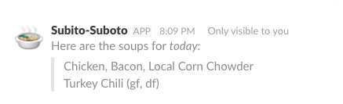
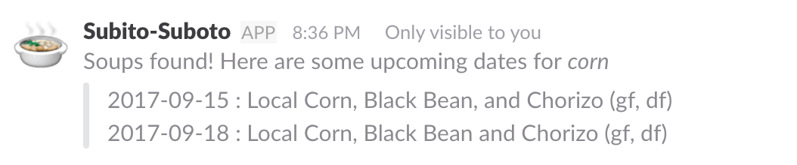

# subito-bot
[](https://travis-ci.org/EPICmynamesBG/subito-bot)
[](https://coveralls.io/github/EPICmynamesBG/subito-bot?branch=master)
[](http://online.swagger.io/validator?url=https://dev.brandongroff.com:8443/api-docs)


A slash command Slack bot for getting the daily soup selection from Indianapolis' [_Subito_](http://www.subitosoups.com/)

## Usage
```text
/subito - what's on the menu today!
```


```text
/subito [today | tomorrow | yesterday | YYYY-MM-DD] - what's on the menu for some day

OR

/subito day [today | tomorrow | yesterday | YYYY-MM-DD]
```


```text
/subito subscribe
```


```text
/subito unsubscribe
```


```text
/subito search [search string]
```


_In Development Commands_

- Subscribe to specific soup types
```text
/subito subscribe [soup name/type (ex: gouda)]
```

## Docs

[Localhost Docs](http://localhost:3000/docs)

[Online Docs](https://dev.brandongroff.com:8443/docs)

## Cron Schedule

|         Job            |  Runtime         |    Description                                                                   |
|------------------------|------------------|----------------------------------------------------------------------------------|
| Soup Calendar Importer | 12:00am Sunday   | Fetches the latest soup calendar, parses, and updates the soup calendar database |
| Subscriber Messaging   | 10:00am Weekdays | Handles messaging all subscribers the day's soups                                |

\* _Hosted server timezone runs in [EST](https://time.is/EST)_

## Development

### Requirements

 - mysql
 - node/npm (recommend using nvm)
 
#### Setup

- `mysql -e "CREATE DATABASE IF NOT EXISTS subito;" -u root -p`
- `mysql -e "CREATE USER '[username]'@'localhost' IDENTIFIED BY '[password]';" -u root -p`
- `mysql -e "GRANT ALL PRIVILEGES ON subito . * TO '[username]'@'localhost';" -u root -p`
- `mysql -D subito < ddl/ddl.sql -u root -p`

#### Environment

While defaults exist, many things (like connecting to a database) will not work unless
you've set up a local environment (.env) file in the project's root directory. Below is an
example/template you should use.
```text
DATABASE_HOST=localhost
DATABASE_USER=subito
DATABASE_PASSWORD=[password]
DATABASE_NAME=subito
HOST=localhost
TEST_DATABASE_HOST=localhost
TEST_DATABASE_USER=test
TEST_DATABASE_PASSWORD=[test password]
TEST_DATABASE_NAME=subito_test
PORT=3000
SSL_PORT=443
SSL_PRIV_KEY=[absolute path to key]
SSL_CERT=[absolute path to cert]
ENCRYPTION_KEY=[random key]
ADMIN_AUTH_SECRET=[random string]
TEST_LOGGING_LEVEL=fatal
LOGGING_LEVEL=debug
NODE_ENV=development
```

### Swagger Building

By design, the `swagger.yaml` file is git-ignored. This is to leverge dynamic variables per environment, as can be seen in `config/[env].js`. While the _buildSwagger_ command is included at the start of a standard run and test, it does not run when `swagger project start` is used to start the server, nor `node app.js`. So be aware when changes are made to index.yaml that `npm run buildSwagger` needs to run or you won't be up to date.

#### Database Changes

Database changes should be added in the `db-migrations/sql` folder. File names should be something like `[migration id]-[hyphen case description]-[up | down].sql`, with a corresponding up and down file. 

Migrations can be ran via `npm run migrate-up:[local | test]`. This command will process and run _all_ up migrations.
`npm run migrate-down:[local | test]` will run _only the last_ migration down script, so undoing a migration will happen one at a time.

### Testing

#### Setup

- `mysql -e "CREATE DATABASE IF NOT EXISTS subito_test;" -u root -p`
- `mysql -e "CREATE USER 'test'@'localhost' IDENTIFIED BY '[password]';" -u root -p`
- `mysql -e "GRANT ALL PRIVILEGES ON subito_test . * TO 'test'@'localhost';" -u root -p`
- `mysql -D subito_test < ddl/ddl.sql -u root -p`
 
## License

[GNU General Public License v3.0](http://www.gnu.org/licenses/gpl-3.0.txt)
